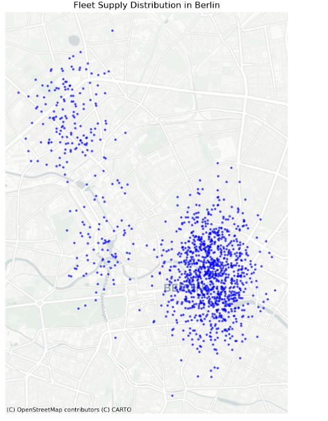

# 🚀 Berlin Fleet Demand & Optimization Analysis

## 📌 Overview
This project analyzes spatial demand and fleet supply distribution in Berlin using simulated micromobility data. It identifies mismatches between demand and supply and proposes rebalancing strategies.This project demonstrates how geospatial analysis can be applied to real-world mobility operations to improve fleet efficiency and service availability.

---

## 🗺️ Demand Hotspots

- High demand observed in Brandenburg and Wedding
- Demand is spatially clustered

---

## 🚲 Fleet Supply Distribution

- High vehicle concentration in Mitte
- Limited supply in Wedding and Hauptbahnhof

---

## 📊 Demand vs Supply Insights

- Wedding → Undersupplied (high demand, low supply)
- Hauptbahnhof → Undersupplied
- Brandenburg → Balanced
- Mitte → High concentration of vehicles

---

## ⏱️ Temporal Demand Pattern

- Peak demand during commuting hours
- Lower activity at night

---

## 🔁 Rebalancing Strategy

- Move vehicles from **Mitte → Wedding**
- Move vehicles from **Mitte → Hauptbahnhof**
- Perform redistribution before peak hours

---

## 🧠 Key Takeaway

This project demonstrates how geospatial analysis can support operational decisions by aligning fleet distribution with demand patterns.

---

## 🛠️ Tech Stack
- Python
- GeoPandas
- Matplotlib
- Contextily

---

## 👤 Author
Usman Yunas Awan
